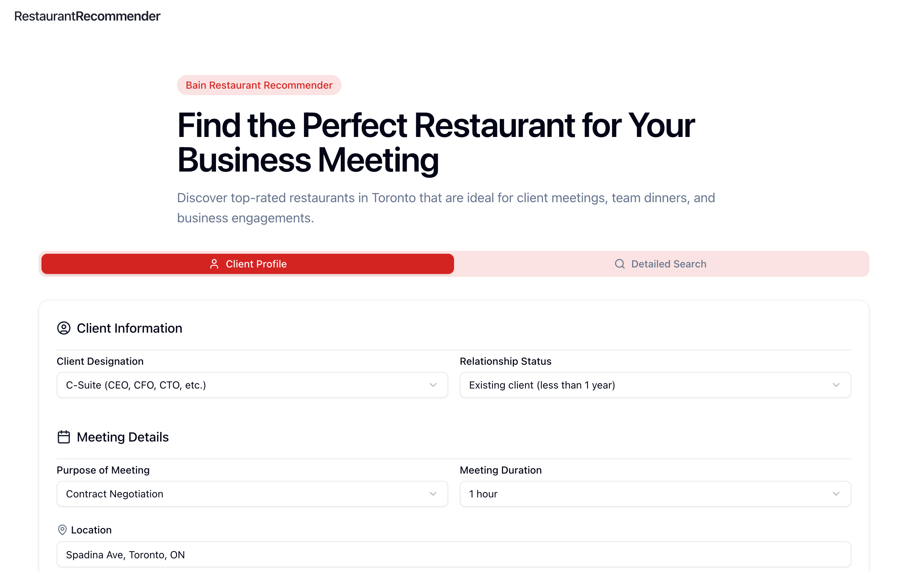

# Bain Restaurant Recommender

A web application that helps Bain partners find restaurants for client meetings. This tool allows users to search for restaurants in different locations and provides detailed information to help make informed decisions.

The frontend interface for the application is deployed on [Vercel](https://vercel.com/), and the backend API is deployed on [Render](https://render.com/) through a Docker container. Please [click here](https://bain-restaurant-recommender.vercel.app/) to view the live application.

> Note that since the backend API is deployed on a free tier of Render, it may take a few minutes to start up when the first request is made.
>

## Demo



## Features

- **Advanced Search Options**: Traditional search by location/filters or client-focused search using LLM-generated personas
- **Detailed Restaurant Information**: View ratings, price ranges, contact information, and menus
- **Business Suitability Score**: AI-generated score based on reviews to assess restaurant suitability for business meetings
- **Multiple Views**: List and map views for restaurant results
- **Mobile-Responsive Design**: Works on desktop and mobile devices

## User Journey

The application is designed to streamline the process of finding appropriate restaurants for client meetings:

1. **Initial Search**:
   - Users can choose between traditional search (location-based) or client-focused search
   - For client-focused search, users provide details about the client and meeting context
   - The system uses LLM to generate a tailored search query based on client profile

2. **Exploring Results**:
   - Users can view results in either list or map view
   - Each restaurant displays key information: rating, price range, cuisine type, location, and distance.

3. **Detailed Assessment**:
   - Users can select a restaurant to view detailed information
   - The system provides business suitability analysis based on reviews
   - Users can access photos, menus, and contact information

4. **Decision Making**:
   - The application highlights factors relevant to business meetings (noise level, privacy, etc.)
   - Users can save favorite restaurants for future reference
   - Contact information is readily available for making reservations

This workflow is designed to save Bain partners valuable time when planning client meetings, ensuring they select venues that create the right impression and environment.

## Tech Stack

- **Backend**: Python 3.12+ with FastAPI
- **Frontend**: Next.js with React, Shadcn UI, and Zustand for state management
- **External APIs**:
  - Yelp Fusion API for restaurant data
  - OpenAI API for LLM-based persona generation
  - Google Maps API for map visualization
  - LangSmith API for tracing and monitoring LLM calls

## Project Structure

```dir
bain-mvp/
├── backend/           # FastAPI application with clean architecture
│   ├── app/           # Application core (API, models, services)
│   ├── main.py        # Main API implementation
│   └── ...            # See backend/README.md for details
├── frontend/          # Next.js application
│   ├── app/           # Next.js app directory
│   ├── components/    # React components
│   ├── lib/           # Utility functions and hooks
│   └── ...            # See frontend/README.md for details
└── start.sh           # Script to start both servers
```

For more detailed information:

- [Backend Documentation](backend/README.md)
- [Frontend Documentation](frontend/README.md)

## Getting Started

### Prerequisites

- Python 3.12+
- Node.js 18+
- [`bun`](https://bun.sh/)
- API Keys:
  - Yelp API Key
  - OpenAI API Key
  - Google Maps API Key (for map functionality)
  - LangSmith API Key (for LLM tracing)

### Environment Setup

1. Backend: Copy the example environment file and add your API keys

   ```bash
   cd backend
   cp .env.example .env
   ```

2. Frontend: Copy the example environment file and add your API keys

   ```bash
   cd frontend
   cp .env.example .env
   ```

### Installation

1. Clone the repository

   ```bash
   git clone <repo-url>
   cd <repo-name>
   ```

2. Install backend dependencies

   ```bash
   cd backend
   uv sync
   cd ..
   ```

3. Install frontend dependencies

   ```bash
   cd frontend
   bun install
   cd ..
   ```

### Running the Application

You can start both the backend and frontend with one command:

```bash
./start.sh
```

Alternatively, you can run them separately:

**Backend:**

```bash
cd backend
uv run main.py
```

**Frontend:**

```bash
cd frontend
bun dev
```

The frontend will be available at: <http://localhost:3000>
The backend API will be available at: <http://localhost:8000/api>

## API Documentation

Once the backend server is running, you can view the interactive API documentation at:

- <http://localhost:8000/api/docs> (Swagger UI)
- <http://localhost:8000/api/redoc> (ReDoc)

## Key Features

### Search Options

1. **Traditional Search**: Find restaurants based on location, cuisine type, price range, and other filters
2. **Client-Focused Search**: Tailored for client meetings, using LLM to generate search queries based on client details

### Restaurant Analysis

- **Customer Reviews**: View and analyze customer feedback
- **Business Suitability**: AI-generated scores for noise level, privacy, formality, and meeting suitability

## Docker Support

The backend includes Docker support. To build and run using Docker:

```bash
cd backend
docker build -t bain-recommender-backend .
docker run -p 8000:8000 bain-recommender-backend
```
