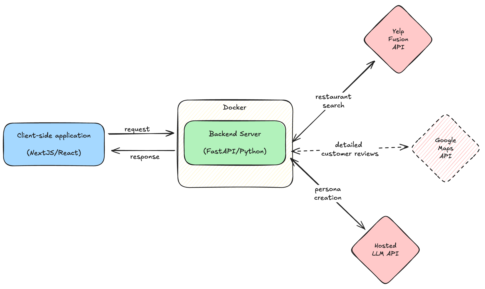

# Answers to Project Management Questions

1. In your own words, describe the problem that your tool is solving and why partners should use it.

Bain Partners in Toronto need a fast, reliable way to choose restaurants for client engagements. Presumably, the current process is to rely on personal experience, recommendations from colleagues, or generic review sites, which could be inefficient and inconsistent from a quality standpoint. My tool, a web-based restaurant recommender, addresses this by offering tailored suggestions based on a client profile. This is different from traditional search engines that require place-specific information and do not take into account the specific needs of the client, which is information that a partner would have based on their relationship with the client.

2. Tell us what pieces of software you think are necessary to develop for the working prototype and how they are related. We call each application (web, mobile or desktop), each API, each batch process that can be deployed independently a piece of software. Support yourself with a diagram if you think necessary.

The prototype requires two core software components:

- Web Application (Front-End): Built with React, this is the user interface where partners input preferences and view a clean, responsive list of restaurant recommendations.
- API Server (Back-End): A FastAPI-based server that handles requests, queries an external restaurant API (e.g., Yelp), filters results, and sends JSON data back to the front-end.

Relationship: The front-end sends user inputs via HTTP requests to the back-end, which processes them, fetches external data, and returns structured results for display.

This separation ensures modularity, enabling future enhancements like caching or additional APIs.

3. Describe the work methodology you would use for development. It can be some known methodology (Scrum, XP, etc.), an adaptation, or a mixture between several methodologies. Whatever your experience has shown you works. Tell us why you think this form is appropriate for the problem.

I’d use a solo-adapted Scrum approach for the short-term timeline, with regular 15-minute check-ins with Andrew for progress updates and feedback:

- Day 1-2: Scope definition, tech stack selection, API testing, building the "cabling" and getting the user I/O flow ready
- Day 3-4: Deployment, iterative coding (back-end API, front-end UI), polishing, and testing (functionality, edge cases)
- Day 5: Final documentation and fixes

This method balances structure with agility, ideal for a short, solo project. My experience shows it delivers a functional MVP quickly by prioritizing incremental progress over rigid timelines, adapting to unforeseen challenges without team overhead.

4. What questions do you have for Christophe? What questions do you have for Andrew?

#### Questions for Christophe

- How do partners currently make these decisions?
- What specific criteria do partners typically consider when selecting restaurants for client meetings? (e.g., price range, cuisine type, ambiance, noise level, privacy)
- What information about restaurants would be most valuable to display in the recommendations? (e.g., menu highlights, private dining options, past partner experiences)
- What would constitute success for this tool from the partners' perspective?

#### Questions for Andrew

- Should the application require authentication, and if so, can we leverage existing Bain authentication systems?
- What metrics should we track to measure success?
- Are there any data privacy concerns or restrictions I should be aware of when integrating with external APIs or storing partner/client information?
- Is there a preferred frontend framework or design system I should use to maintain consistency with other Bain internal tools?

## Additional Notes

- With access to Google Maps API, each restaurant listing can have the reviews pulled in. Then, we can use LLMs to summarize the reviews and provide a quick overview of the restaurant, while allowing the user to ask specific questions.
- The reviews data can also be used to build a "business meeting suitability" score for each restaurant, with levels for noise, privacy, and formality that can be calculated from the reviews using LLMs.
- The LLM-based recommendation engine can be refined further by improving the prompts and adding more context about the event.
